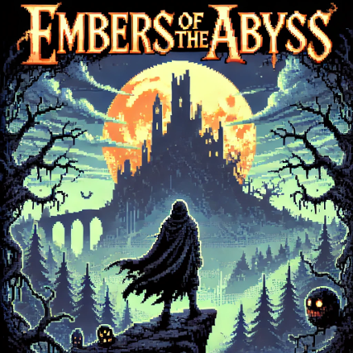

# Embers of the Abyss

**Embers of the Abyss** is a challenging 2D action RPG platformer developed in Java, with a dark, atmospheric aesthetic. This project emphasizes skill-based combat, exploration, and progression in a haunting fantasy world.

---



---

### Table of Contents

- [Overview](#overview)
- [Features](#features)
- [Requirements](#requirements)
- [Setup](#setup)
- [How to Contribute](#how-to-contribute)
- [License](#license)

---

### Overview

Embers of the Abyss uses pixel art to bring its world to life. For all game art and animations, we will use **Piskel**—a free, web-based pixel art editor that's easy to use and accessible to all contributors. This tool is ideal for creating detailed sprites, animations, and other assets that align with our dark fantasy theme.

---

### Features

- **Combat Mechanics**: Light and heavy attacks, block, dodge-roll, and perfect parry mechanics.
- **Health-Retaliation Mechanic**: Allows the player to regain health by retaliating damage shortly after taking it.
- **Exploration**: Discover hidden paths, secret rooms, and lore items.
- **Progression System**: Defeating enemies earns currency for upgrading stats.

---

### Requirements

- **Java 8** or higher
- **VS Code** with **Java Extension Pack** or another Java IDE
- **Git** for version control
- **Piskel** (for art) - [Piskel](https://www.piskelapp.com/)

---

### Setup

1. **Clone the Repository**:

   ```bash
   git clone https://github.com/Inspiractus01/EmbersAbyss.git
   cd EmbersAbyss
   ```

2. **Open in VS Code** (or your preferred IDE):

   - Open the project folder in VS Code.
   - Make sure the Java Extension Pack is installed if you're using VS Code

3. **Dont forget to initialize Saxion Library:**
   Press Ctrl+Shift+P (Windows/Linux) or Cmd+Shift+P (Mac) to open the Command Palette.

   - Type **Java: Configure Java Runtime** and select it.
   - Click on Libraries and Add library and select `Saxionapp.java` file
   - Click Apply and you should have generated file `.vscode`

4. **Build and Run**:
   - Compile and run `Main.java` to test your setup.

---

### How to Contribute

1. **Check `dev` Branch**:

   - Ensure the dev branch is up-to-date with main by syncing it.

   ```bash
   git checkout dev
   git pull origin main
   ```

2. **Create a New Feature Branch from `main`**:

   - Always create your feature branch directly from `main`, not `dev` !!! . This ensures your branch starts clean and avoids unnecessary conflicts.

   ```bash
   git checkout main
   git pull origin main
   git checkout -b feature-name
   ```

3. **Make Changes**:

- Implement your feature or fix while keeping your code clean, modular, and well-documented.
- Follow any coding guidelines provided by the project.

4. **Commit and Push**:
   ```bash
   git add .
   git commit -m "Short description of your changes"
   git push origin feature-name
   ```
5. **Create a Pull Request:**:

   - Create a Pull Request (PR) on GitHub to merge your branch into the `dev` branch.
   - Send your PR link to Michal or Matheus for code review.

6. **Merging to `dev`**:
   - After review and team approval, your branch will be merged into dev. This ensures `dev` remains the testing ground for all changes before they reach `main`.
7. **Merging `dev` to `main`:**:
   - Only after thorough testing, the dev branch can be merged into main.
   - Open a PR for dev → main and wait for final approval.
-----------------------------

### Naming branches !
8. Rules for Naming Branches
Always name branches using this format:
  ```task/#<task_number>/<branch_name>```

- **Task Number**: Found on Trello.  
- **Branch Name**: Short, descriptive, lowercase, with words separated by hyphens (`-`).

**Example**:  
  ```task/#18/adding-new-feature```

This ensures the repository stays organized and easy to navigate.


